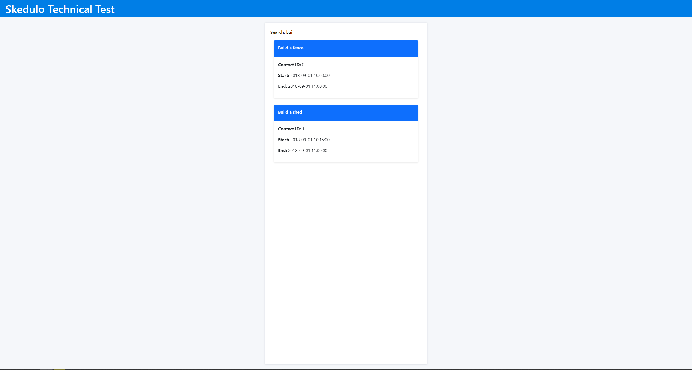
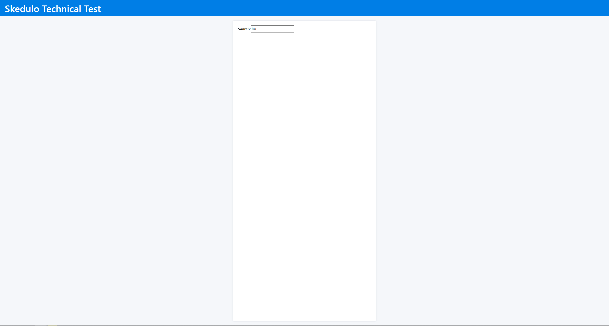

# Skedulo Tech Test

I believe that I completed the task to the specification here. Hope you like it!

## Running Demo
Run: ```yarn start```
## Images Of Demo

This is when at least 3 characters are inputted also match entries in the DB.


When two characters are inputted, no results are given.